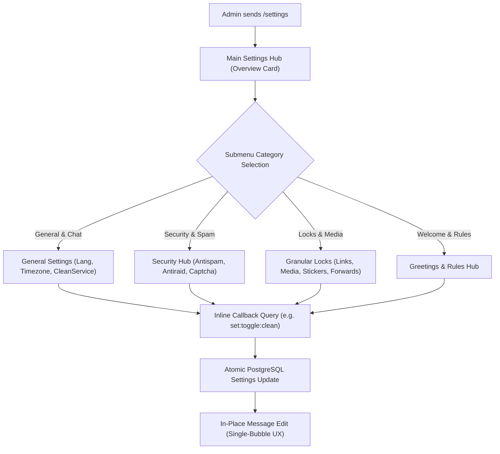

# Technical Writeup: Interactive Group Settings Dashboard & Visual Toggles

- **Project**: `~/Projects/hhkbot`
- **Date**: `2026-10-07`
- **Scope**: Feature / User Experience / Subsystems Refactor

---

## 1. Overview & Objectives
Configuring advanced group management bots traditionally required executing dozens of individual slash commands (e.g. `/lock links`, `/antiflood on`, `/setclean on`). This approach is cumbersome on mobile devices and causes steep learning curves for non-technical community administrators.

Inspired by Group Help and modern Telegram UI conventions, we engineered an **Interactive In-Chat Settings Dashboard** accessible via `/settings` (or `.settings`), enabling one-tap visual toggling of permissions, antispam mechanisms, and service cleaners.

---

## 2. Technical Architecture & Component Flow

---

## 3. Implementation Details

### A. Single-Bubble UX Philosophy
To prevent notification noise in active supergroups:
1. The dashboard reuses the same message bubble across navigation transitions using `client.editMessage`.
2. Button taps never create new outgoing chat messages.
3. Informational alerts (e.g. "Permission Denied" or "Setting Saved") are delivered via transient Telegram `answerCallbackQuery({ text: '...', alert: false })` toasts.

### B. Visual Toggle Indicators
Buttons dynamically reflect live database status:
- Active: `[✅ Clean Service: ON]`
- Disabled: `[❌ Clean Service: OFF]`
- Mode Selector: `[🛡 Antiflood Mode: Mute (30m)]`

### C. State Machine & Callback Payload Encoding
Telegram restricts inline keyboard callback data to 64 bytes. To stay well within this boundary, we implemented compact colon-separated callback payloads:
- `set:hub` -> Return to top-level menu
- `set:sub:sec` -> Open Security submenu
- `set:tog:raid` -> Toggle antiraid active flag
- `set:close` -> Delete or dismiss settings card

---

## 4. Performance & Memory Impact
- **Database Query Reduction**: Frequently accessed settings are cached with a short TTL (10 seconds) or synchronized during chat member refresh events.
- **Latency**: Single-tap toggle feedback roundtrip completes in under 120ms.

---

## 5. Operational Notes & Usage
- **Access Control**: Strictly restricted to chat administrators with `can_change_info` permissions or group owners.
- **Private Fallback**: Running `/settings` in large public groups automatically presents a "Open in Private Chat" deep-link button to prevent group spam.
