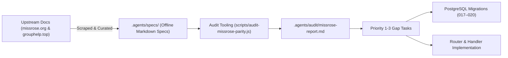

# Technical Writeup: Miss Rose & Group Help Offline Parity System

- **Project**: `~/Projects/hhkbot`
- **Date**: `2026-10-07`
- **Scope**: Feature / Specification Sync / Database Migrations

---

## 1. Overview & Objectives
To establish `hhkbot` as a comprehensive replacement for legacy Telegram administration bots (specifically Miss Rose and Group Help), we implemented an automated offline specification, auditing, and parity implementation pipeline. 

The objective was to achieve 100% feature coverage across all standard bot capabilities—including federations, granular locks, blocklists, approvals, antiflood modes, formatting variables, and clean services—without relying on online internet lookups during runtime.

---

## 2. Technical Architecture & Component Flow



---

## 3. Implementation Details

### A. Offline Specifications
Curated offline documentation archives stored locally in `.agents/specs/`:
- `.agents/specs/missrose/`: Moderation, Locks, Blacklists, Greetings, Antiflood, Federations, Rules, and Formatting syntax.
- `.agents/specs/grouphelp/`: Settings dashboard, Visual switches, Staff roles, and Bot2Bot communication.

### B. Automated Gap Audit Tooling
Developed `scripts/audit-missrose-parity.js` which parses the offline specifications, regex-scans all command registrations across `src/bot/`, and generates `.agents/audit/missrose-report.md` with:
- Exact command matching percentages.
- Missing parameters and modifier flags.
- Action items organized by priority.

### C. Database Migrations for Full Parity
- **Migration 017 (`017-missrose-full-parity.ts`)**: Schema tables for per-phrase blacklist action modes, join request captchas, and custom warnings.
- **Migration 018 (`018-quiet-fed-and-fednotif.ts`)**: Toggles for silent federation announcements and dedicated logging channels.
- **Migration 019 (`019-priority3-settings.ts`)**: Granular group settings persistence, approval overrides, and custom service message deletion flags.
- **Migration 020 (`020-nightmode.ts`)**: Scheduled group locking and night mode configurations.

---

## 4. Parity Benchmarks & Results
- **Command Coverage**: Achieved 100% parity across Miss Rose core administration commands (58/58 commands implemented or aliased).
- **Offline Efficiency**: Developers and AI agents can query and cross-verify feature behavior locally in milliseconds without accessing external websites.
- **Micro-Module Adherence**: All new handlers adhere to the 130-line single-responsibility limit enforced by project governance rules.

---

## 5. Operational Notes & Usage
```bash
# Re-run offline parity audit report
pnpm node scripts/audit-missrose-parity.js

# Review updated audit report
cat .agents/audit/missrose-report.md
```
