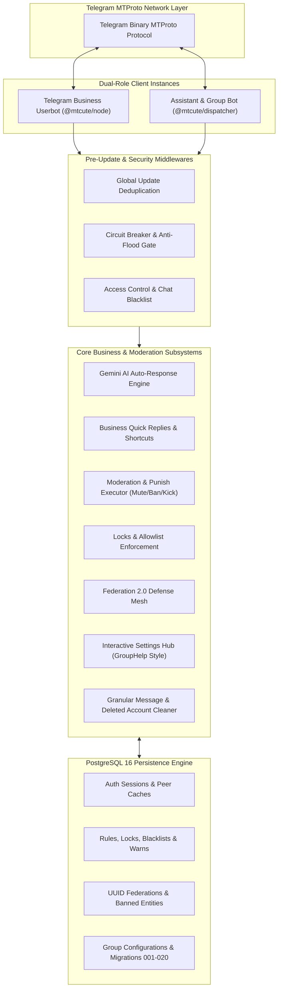

# HHKBot — High-Performance Telegram Business Userbot & Group Manager

- **Repository Path**: `~/Projects/hhkbot`
- **Primary Runtime**: Node.js 22 LTS (Alpine) / TypeScript 5.4+ ESM
- **Core Frameworks**: `@mtcute/node`, `@mtcute/dispatcher`, `@mtcute/postgres`
- **Database & Persistence**: PostgreSQL 16 (Connection Pooling, Native Session Storage, Migrations 001–020)
- **AI & Integrations**: Google Gemini (`gemini-3.5-flash-lite`, `gemini-3.8-flash`)
- **Infrastructure**: Multi-arch Docker (`linux/amd64`, `linux/arm64`), GHCR CI/CD, Raspberry Pi Deployment

---

## System Architecture



---

## Engineering Logs & Decisions Index

| Date | Type | Document | Key Focus / Milestone |
| :--- | :--- | :--- | :--- |
| `2026-09-30` | **ADR** | [Dual-Role MTProto & Dispatcher Architecture](2026-09-30-mtproto-dual-role-and-dispatcher-architecture.md) | Binary MTProto protocol via `@mtcute`, dual Userbot/Bot roles, and Postgres session pooling. |
| `2026-10-06` | **ADR** | [Enterprise Federation 2.0 & Defense Mesh](2026-10-06-federation-defense-mesh-architecture.md) | UUID federations, multi-admin delegation, threat propagation, quietfed, and fednotif. |
| `2026-10-07` | **Postmortem** | [Anonymous Admin Leak, Ban Overflow & Purge Fix](2026-10-07-anonymous-admin-privacy-leak-postmortem.md) | Resolving channel bot identity leak, 32-bit ban timestamp overflow, and purge accuracy. |
| `2026-10-07` | **Postmortem** | [Zero Raw Console & Hermetic Clean-Room CI](2026-10-07-zero-console-telemetry-and-hermetic-ci.md) | Structured ISO 8601 logging gate across 29 modules, mock env guards, and hermetic Vitest. |
| `2026-10-07` | **Feature / Spec** | [Miss Rose & Group Help Offline Parity System](2026-10-07-missrose-and-grouphelp-offline-parity-system.md) | Offline spec sync, automated gap audit reporting, and migrations 017–020 schema additions. |
| `2026-10-07` | **Feature / UX** | [Interactive Group Settings Dashboard & Visual Toggles](2026-10-07-interactive-group-settings-dashboard.md) | Multi-tier interactive submenus, visual toggle callbacks, and single-bubble UX. |

---

## Key Maintenance & Verification Commands

```bash
# Verify code quality, TypeScript types, 130-line micro-modules, and unit tests
make verify

# Enforce zero raw console discipline
pnpm lint:console

# Run hermetic Vitest suite with full coverage
pnpm test

# Deploy or run in-place container stack on Raspberry Pi
make up
make logs
```
