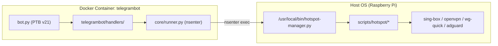

# Architecture Decision Record (ADR): Modular Decoupling of Hotspot Core and Telegram Bot

- **Project**: `~/Projects/vpn` (`rpi-vpn-hotspot`)
- **Date**: `2026-10-04`
- **Status**: `Accepted`
- **Decider(s)**: Hein Htet Kyaw

---

## 1. Context & Problem Statement

Historically, the project operated with a monolithic script (`hotspot-manager.py`, >1,200 lines) combined with tightly coupled Telegram bot code. This led to severe technical liabilities:
- **High Cognitive Load**: A single bug in routing or AdGuard DNS handling could break the Telegram bot's status polling.
- **Testing Nightmare**: Writing unit tests required mocking sprawling global states and multiple system calls simultaneously.
- **Privilege Separation Issues**: The Telegram bot needed container isolation, while hotspot controls required raw host networking and `iptables` modifications.
- **Token Inefficiency**: AI agent sessions had to repeatedly ingest monolithic files, bloating context windows and causing high token waste.

A clean separation of concerns was required to isolate core networking logic from the Telegram user interface, while enforcing strict file sizing and single-responsibility principles (SRP).

---

## 2. Decision

We decomposed both the host CLI utility and the Telegram bot into two independent, modular Python packages adhering to the **"Sweet Spot" File Sizing Rule (< 300 lines per file)**:

### 1. Core Hotspot Package (`scripts/hotspot/`)
Installed to the host Python environment (`/usr/local/lib/python3.*/dist-packages/` or module path):
- `hotspot-manager.py`: Thin CLI wrapper entrypoint (~30 lines) at `/usr/local/bin/hotspot-manager.py`.
- `constants.py`: TypedDicts, protocol definitions, static error strings, and emoji mappings.
- `runner.py`: Safe host execution primitives using `subprocess.run` with timeouts and sanitized outputs.
- `context.py`: Dynamic execution facade resolver (detecting direct host vs container execution).
- `singbox.py`: Sing-box configuration builder, dynamic routing JSON generator, and process supervisor.
- `profiles.py`: Country profile scanner supporting both `.ovpn` and `.conf` configs.
- `vpn.py`: Service lifecycle controller for switching between VLESS, OpenVPN, WireGuard, and AmneziaWG.
- `routing.py`: Dynamic policy routing, IP set synchronizer, and routing table reloader.
- `adguard.py`: AdGuard Home DNS sinkhole management, DoH/DoT leak protection, and IPv6 blocking.
- `status.py`: Health checks, latency diagnostics, upstream connectivity, and client telemetry.
- `formatter.py`: Pure rendering functions for both terminal ANSI and Telegram HTML formatting.
- `cli.py`: Argument parser and dispatch router.

### 2. Dockerized Telegram Bot (`telegrambot/`)
Containerized with minimal host permissions, interacting with the host system exclusively via `nsenter`:
- `bot.py`: Minimal application runner (~120 lines) initializing handlers and polling loops.
- `core/runner.py`: Executes `/usr/local/bin/hotspot-manager.py` via `nsenter -t 1 -m -u -n -i` without exposing root Docker sockets.
- `core/config.py`: Environment-driven configuration and Telegram User ID whitelist RBAC.
- `core/dynamic_emojis.py`: Dynamic Telegram Premium custom emoji enrichment.
- `ui/`: Modular keyboard factories (`main_keyboard.py`, `vpn_keyboards.py`, `country_keyboards.py`, `adguard_keyboards.py`).
- `handlers/`: Distinct callback and command handlers (`status.py`, `vpn.py`, `country.py`, `adguard.py`, `maintenance.py`, `text_router.py`).

---

## 3. Rationale & Trade-offs

- **Single Responsibility Principle (SRP)**: Each subsystem has zero cross-coupling. `adguard.py` knows nothing about Telegram keyboards; `status.py` delegates rendering to `formatter.py`.
- **Host / Container Security**: The bot container has no elevated privileges except scoped PID 1 namespace entry, safeguarding host filesystem integrity.
- **Fast Lookup Navigation**: Agents and developers can jump directly to specific features using a topic matrix without reading more than 150 lines at a time.
- **Trade-off**: Managing Python packaging and file syncing between git workspace and `/usr/local/lib/` requires `setup.sh` installation logic and CI verification.

---

## 4. Alternatives Considered

- **Monolithic Script with Functions**:
  - *Pros*: Single file to copy.
  - *Cons*: Regression prone, untestable, impossible to maintain cleanly.
- **Direct REST API / Unix Socket Server**:
  - *Pros*: Avoids `nsenter` execution.
  - *Cons*: Added daemon overhead, memory footprint on Raspberry Pi, and requires an extra authentication layer between daemon and bot.

---

## 5. Consequences & Implementation Impact

- **Test Isolation**: Created two decoupled test suites:
  - `tests/test_hotspot_manager.py` running granular `tests/hotspot/test_*.py`.
  - `tests/test_telegram_bot.py` running granular `tests/bot/test_*.py`.
- **Zero Circular Dependencies**: Enforced unidirectional dependencies: `cli.py` -> modules -> `runner.py` / `constants.py`.
- **Installer Update**: Enhanced `setup.sh` to package and install `scripts/hotspot/` directly to host Python library path alongside `/usr/local/bin/hotspot-manager.py`.
