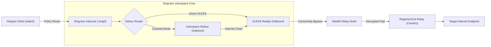

# Architecture Decision Record (ADR): Sing-box Userspace Detour and Multi-Hop Tunneling

- **Project**: `~/Projects/vpn` (`rpi-vpn-hotspot`)
- **Date**: `2026-10-04`
- **Status**: `Accepted`
- **Decider(s)**: Hein Htet Kyaw

---

## 1. Context & Problem Statement

Standard VPN setups on Linux (e.g. kernel OpenVPN `tun0` or WireGuard `wg0`) present major limitations when running a high-security hotspot in censored network environments:
1. **DPI Vulnerability**: Traditional OpenVPN and standard WireGuard handshakes are vulnerable to ISP-level Deep Packet Inspection (DPI) and throttling.
2. **Kernel Route Collisions**: Running multiple simultaneous kernel tunnels causes default gateway race conditions, MTU mismatch headaches, and complex `ip rule` table conflicts.
3. **Exit Point Flexibility**: We needed the stealth and speed of VLESS (Reality) obfuscation, but also required the ability to exit from 49+ specific geographic regions provided by commercial VPN servers (e.g. OpenVPN Unlimited profiles).

We needed an architecture capable of chaining stealth obfuscation with arbitrary geographic exit points in userspace without polluting kernel routing tables.

---

## 2. Decision

We implemented a **Sing-box Userspace Multi-Hop Detour Architecture**:

### Key Technical Mechanisms:
1. **Userspace TUN (`sing0`)**: Sing-box binds an unmanaged userspace TUN interface without overriding the kernel's default route table (`table 51820` / custom policy routing).
2. **Native Userspace Protocols**: Both VLESS (with TLS Reality camouflage) and OpenVPN / WireGuard clients run inside Sing-box's userspace engine, eliminating the need for Linux kernel kernel modules.
3. **Detour Outbound Chaining**:
   - In chained mode, Sing-box routes outgoing traffic through the regional OpenVPN/WireGuard profile via `detour: "vless-out"`.
   - The first hop masks the connection as legitimate HTTPS traffic (e.g. SNI targeting approved domains), while the second hop provides geographic location spoofing.
4. **Resilient Handshake Polling & Direct Fallback**:
   - When switching countries or backends, `scripts/hotspot/singbox.py` polls connection readiness via a non-blocking health check loop.
   - If the multi-hop handshake fails (timeout > 8s), the supervisor automatically rolls back to direct VLESS mode, preventing hotspot blackout.

---

## 3. Rationale & Trade-offs

- **Robust DPI Evasion**: Traffic leaving the Raspberry Pi looks like standard TLS traffic destined for mainstream CDNs/servers, preventing ISP protocol-based blocking.
- **Zero Kernel Pollution**: No dynamic creation and destruction of kernel `tun0` devices or modifying main routing tables on country switches.
- **Dynamic Configuration Generation**: `scripts/hotspot/singbox.py` parses arbitrary `.ovpn` or WireGuard `.conf` files on the fly and generates pure JSON configurations for Sing-box v1.10+.
- **Trade-off**: Higher CPU usage in userspace packet translation compared to pure kernel WireGuard (`wireguard.ko`). On a Raspberry Pi 4, benchmarks showed throughput exceeding 85 Mbps, easily saturating typical local ISP uplink capacities.

---

## 4. Alternatives Considered

- **Double-Tunnel Kernel WireGuard over OpenVPN**:
  - *Pros*: Familiar tooling.
  - *Cons*: Severe MTU clamp issues (dropped packets on 1280 MTU), route loops, high configuration fragility.
- **Shadowsocks + V2Ray Plugin**:
  - *Pros*: Obfuscation supported.
  - *Cons*: Shadowsocks signatures are actively filtered by modern ISP DPI; Sing-box Reality offers superior SNI camouflage and lower handshake latency.

---

## 5. Consequences & Implementation Impact

- **Configuration Path**: Managed configs stored dynamically in `/etc/sing-box/config.json`.
- **Profile Discovery**: `scripts/hotspot/profiles.py` scans `/etc/goodwifi/profiles/` and extracts server hostnames, credentials, cipher suites, and country metadata automatically.
- **Deprecation Cleanups**: Removed obsolete `sniff` directives in inbound configurations for compatibility with Sing-box v1.13+.
- **Supervision**: Controlled via `systemctl restart sing-box` with automated health validation in `scripts/hotspot/status.py`.
