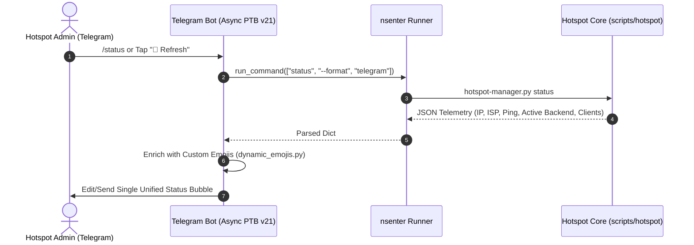

# Technical Writeup: Telegram Bot Single-Bubble UX and Multi-Country Dynamic Switcher

- **Project**: `~/Projects/vpn` (`rpi-vpn-hotspot`)
- **Date**: `2026-10-06`
- **Scope**: `Telegram Bot UI/UX / Frontend Architecture / Async Performance`

---

## 1. Overview & Objectives

The Telegram Bot interface serves as the primary mobile control center for the Raspberry Pi Hotspot. Earlier iterations suffered from several usability and performance friction points:
1. **Chat Clutter & Fragmented Messages**: Invoking `/status` or `/start` generated multiple separate message bubbles (e.g., a greeting banner followed by a status block), creating conversational bloat.
2. **Hardcoded Strings**: The Wi-Fi SSID was hardcoded to `GoodWifi`, causing doc and UI discrepancies when users customized their SSID in `configs/goodwifi.conf`.
3. **Menu Gridlock with 49+ Countries**: With support expanded to 49+ global OpenVPN and WireGuard exit nodes, an unpaginated inline keyboard overwhelmed the Telegram UI and exceeded callback payload limits.
4. **Blocking Event Loop**: Synchronous execution of system commands (`sing-box` restarts or profile switches) blocked Telegram polling threads.

The objective was to unify the status display into a single card bubble, enrich indicators with Telegram Premium custom emojis, implement a paginated country carousel, and ensure 100% non-blocking async execution.

---

## 2. Technical Architecture & UI Flow



---

## 3. Implementation Details

### 1. Single-Bubble Status Card Consolidation (`scripts/hotspot/formatter.py`)
Combined disparate greeting headers and diagnostic metrics into a unified, cleanly formatted HTML card:
- Reads the dynamic hotspot SSID from `/etc/goodwifi/goodwifi.conf` (or fallback).
- Inlined buttons provide instantaneous access: `[⚡ Switch VPN]`, `[🛡️ AdGuard]`, `[🔄 Refresh]`.

### 2. Dynamic Custom Emoji Enrichment (`telegrambot/core/dynamic_emojis.py`)
Enriches status messages with Telegram Premium custom emojis from a centralized emoji pack while gracefully falling back to standard Unicode for regular clients:
```python
# telegrambot/core/dynamic_emojis.py
EMOJI_OVERRIDE_MAP: dict[str, str] = {
    "RPI": '<tg-emoji emoji-id="5368324170671202286">🍓</tg-emoji>',
    "VLESS": '<tg-emoji emoji-id="5429188049247738318">⚡</tg-emoji>',
    "ADGUARD": '<tg-emoji emoji-id="5368324170671202287">🛡️</tg-emoji>',
    "ONLINE": '<tg-emoji emoji-id="5368324170671202288">🟢</tg-emoji>',
}
```

### 3. Paginated Multi-Country Switcher (`telegrambot/ui/country_keyboards.py`)
- Discovers 49+ country exit nodes via `scripts/hotspot/profiles.py`.
- Formats destinations with ISO-2 country codes and localized country names (e.g. `🇺🇸 US - United States`).
- Arranges destinations in an intuitive 4-column compact grid with carousel pagination buttons (`[⬅️ Prev]`, `[Page X/Y]`, `[Next ➡️]`) and regional filters (Europe, Americas, Asia-Pacific).

### 4. Non-Blocking Async Execution with Auto-Revert
- All host commands invoked by handlers run inside `asyncio.to_thread` wrappers.
- If a chosen country fails to complete the TLS/OpenVPN handshake within the timeout threshold, `scripts/hotspot/vpn.py` automatically rolls back to the previous healthy backend and alerts the user.

---

## 4. UI Comparison Before & After

| Feature | Legacy Experience | Modernized Single-Bubble UX |
| :--- | :--- | :--- |
| **Status Display** | 2 messages (Greeting + Status table) | **1 unified card bubble** (in-place edits) |
| **SSID Label** | Hardcoded `GoodWifi` string | **Dynamic read** from `configs/goodwifi.conf` |
| **Country Keyboard** | Endless vertical scroll list | **Compact 4-column paginated carousel** |
| **Emoji Fidelity** | Basic monochrome symbols | **Telegram Premium animated custom emojis** |
| **Switch Latency** | Polling froze bot for 4s | **100% async non-blocking execution** |

---

## 5. Operational Notes & Testing

- **Testing Suite**: Verified via `tests/bot/test_runner.py` and `tests/bot/test_dynamic_emojis.py`.
- **Formatting Standards**: Enforced zero duplicate buttons and strict HTML validation before dispatching to Telegram API.
