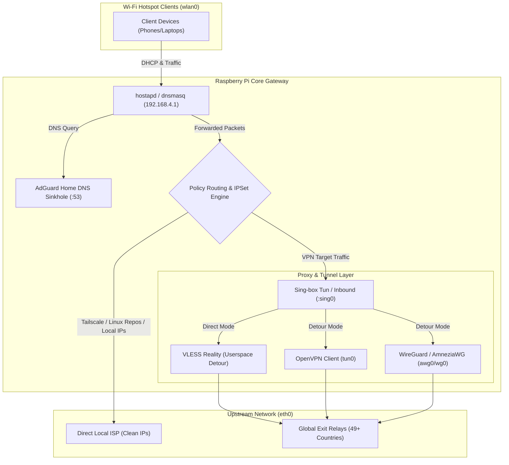

# Raspberry Pi VPN Hotspot (`rpi-vpn-hotspot` / `vpn`)

- **Repository Path**: `~/Projects/vpn`
- **Primary Hardware**: Raspberry Pi 4 / Compute Module (Dual interface: `eth0` WAN / `wlan0` AP)
- **Core Technologies**: Sing-box (VLESS Reality), OpenVPN, WireGuard, AmneziaWG, AdGuard Home, `iptables`/`ipset`, Hostapd, Dockerized Telegram Bot (`python-telegram-bot` v21+).

---

## Architecture Overview



---

## Engineering Logs & Decisions Index

| Date | Type | Document | Key Focus / Milestone |
| :--- | :--- | :--- | :--- |
| `2026-10-04` | **ADR** | [Modular Hotspot Core & Bot Decoupling](2026-10-04-modular-hotspot-and-telegram-bot-architecture.md) | Decomposing monolithic scripts into SRP Python packages and Docker `nsenter` runner. |
| `2026-10-04` | **ADR** | [Sing-box Detour & Multi-Hop Chaining](2026-10-04-singbox-userspace-detour-and-multihop-routing.md) | VLESS Reality userspace detour over OpenVPN/WireGuard with failover to direct mode. |
| `2026-10-05` | **Postmortem** | [AdGuard DNS Leak & DoH/DoT Bypass](2026-10-05-adguard-dns-leak-and-doh-bypass-postmortem.md) | Resolving DNS query leaks on VPN switches via port 853 reject and provider blocking. |
| `2026-10-05` | **Feature / System** | [Policy Routing & IPSet Split-Tunneling](2026-10-05-policy-routing-and-ipset-split-tunneling.md) | Dynamic ipset routing separation for GitHub, Tailscale, Linux package mirrors, and ISP bypass. |
| `2026-10-06` | **Feature / UX** | [Telegram Bot Single-Bubble UX & Country Switcher](2026-10-06-telegram-bot-single-bubble-ux-and-country-switcher.md) | Merging status cards into a unified bubble, custom emoji flag packs, and 49-country carousel. |

---

## Key Maintenance Commands

```bash
# Run automated quality analysis and isolated test suites
make test
make analyze

# Check real-time hotspot status on host
sudo python3 /usr/local/bin/hotspot-manager.py status

# Inspect running container services
docker compose -f /home/hhk/Projects/vpn/docker-compose.yml ps
```
